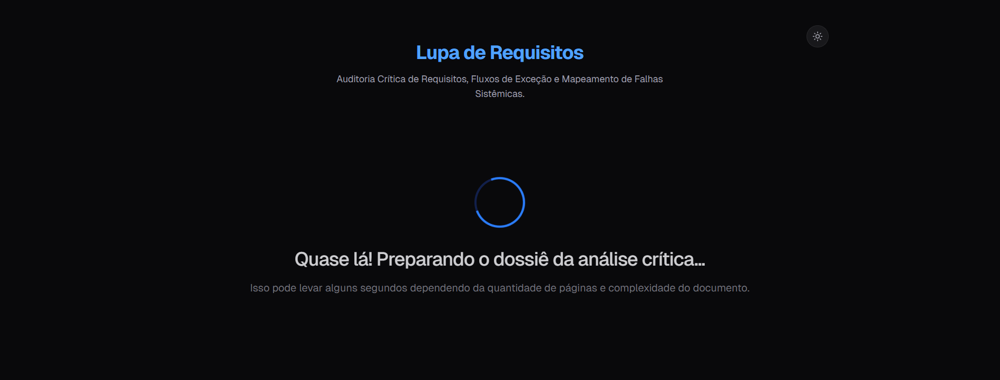
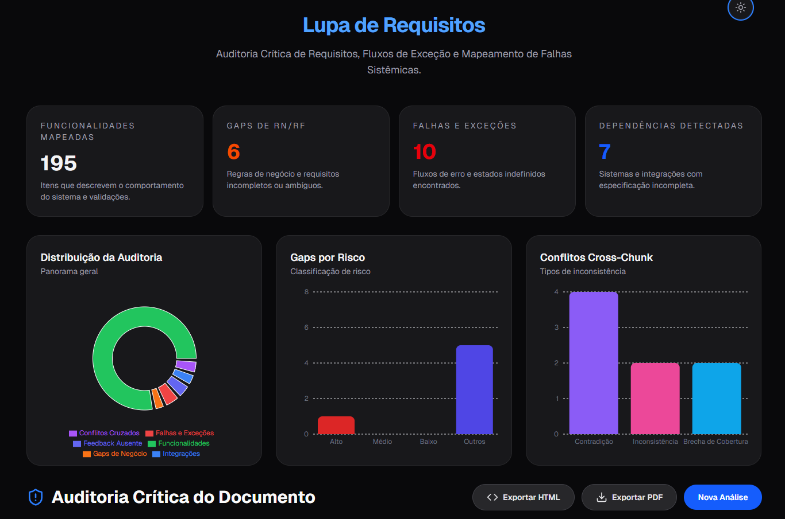
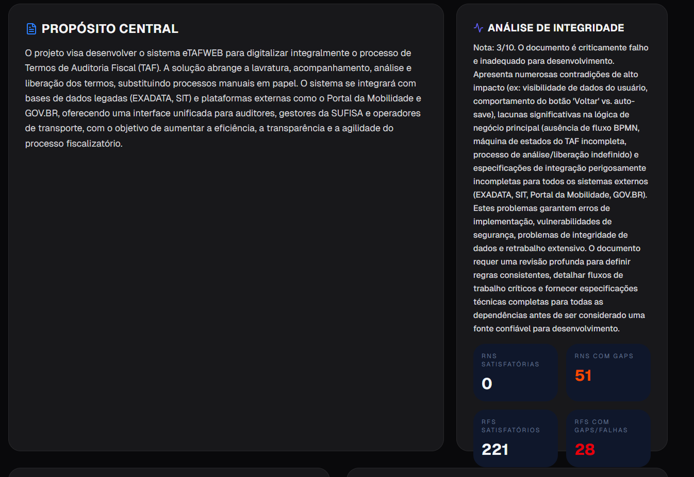
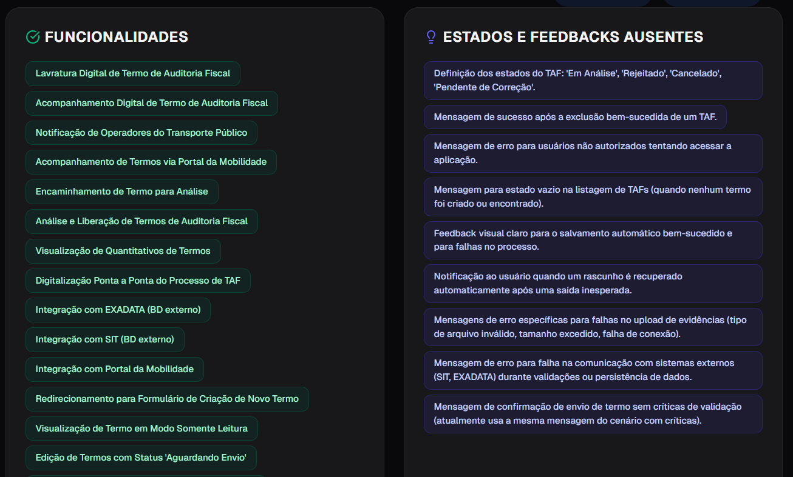
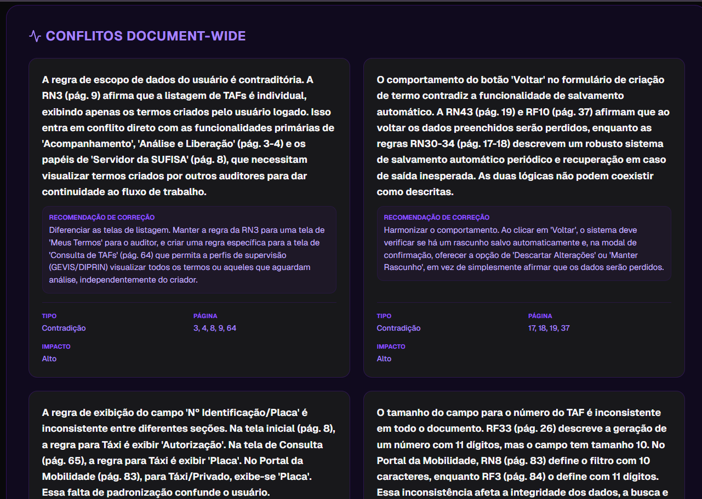
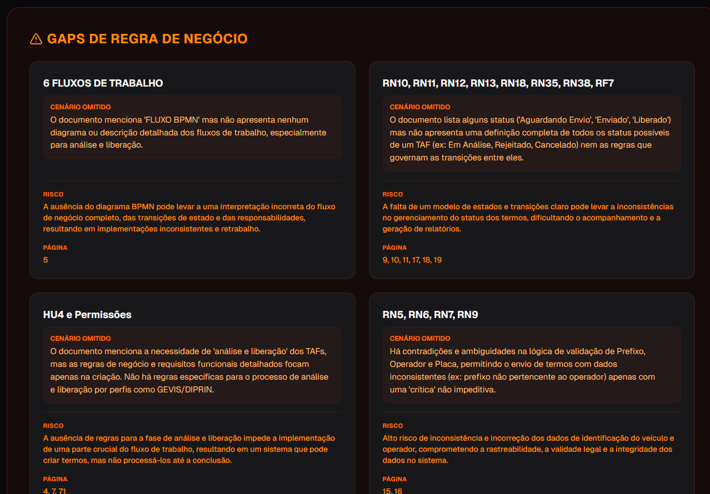
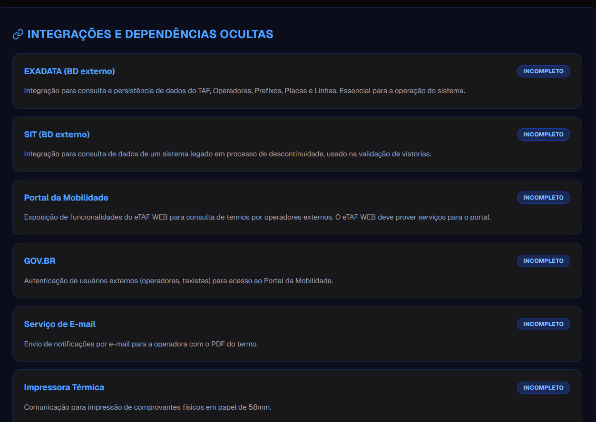
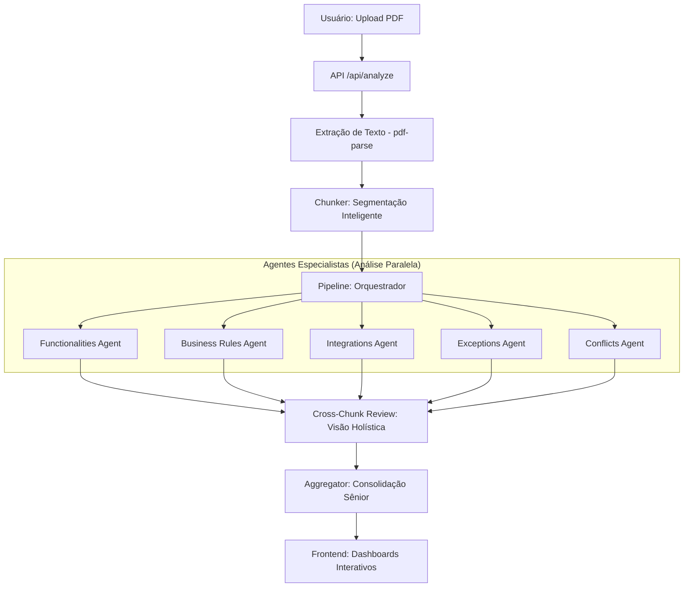

# Lupa de Requisitos

Uma ferramenta inteligente de Auditoria Técnica e Análise de Requisitos, construída com **Next.js 14+ (App Router)** e impulsionada pela API do **Google Gemini 2.5 Flash**. 

O sistema foi projetado para transformar documentos complexos (PDF) em relatórios técnicos estruturados, identificando funcionalidades, falhas lógicas, conflitos e gaps de negócio com alta precisão através de um pipeline de multi-agentes.

---

## 📺 Demonstração Visual

### 📤 Upload de Documento
A interface limpa e intuitiva permite o upload via drag-and-drop, processando arquivos PDF inteiramente em memória para máxima segurança.



### 📊 Visão Geral e Métricas
Após a análise, o dashboard apresenta métricas de qualidade e uma visão geral do projeto.



### 🧩 Detalhamento por Camadas
A análise é segmentada para facilitar a revisão por QAs e Analistas:

| Objetivo e Escopo | Funcionalidades |
| :---: | :---: |
|  |  |

| Conflitos e Ambiguidades | Gaps de Negócio |
| :---: | :---: |
|  |  |

| Integrações e Dependências |
| :---: |
|  |

---

## 🚀 Funcionalidades Principais

- **Multi-Agent Pipeline:** Orquestração de múltiplos especialistas de IA para análise profunda.
- **Detecção de Conflitos Cruzados:** Identifica contradições entre diferentes partes do mesmo documento.
- **Análise de Impacto e Gravidade:** Categorização automática de falhas lógicas e riscos.
- **Mapeamento de Gaps:** Identificação de fluxos de exceção e regras de negócio não descritas.
- **Exportação Otimizada:** Relatórios formatados para impressão ou exportação em PDF.
- **Segurança Enterprise:** Processamento 100% em memória (sem persistência de arquivos sensíveis).

---

## 🏗️ Arquitetura do Sistema (Pipeline de IA)

A aplicação utiliza uma arquitetura de **Pipeline de Multi-Agentes** para garantir especialização e precisão.

### 🔄 Fluxo de Análise




### 🧩 Componentes do Core

1.  **Chunker**: Divide o texto em blocos semânticos para respeitar o limite de contexto e aumentar a "atenção" da IA em detalhes.
2.  **Pipeline Orchestrator**: Gerencia a execução paralela dos agentes especialistas.
3.  **Agentes Especialistas**:
    *   **Functionalities**: Mapeia o escopo funcional.
    *   **Business Rules**: Analisa a consistência das regras.
    *   **Integrations**: Detecta dependências técnicas.
    *   **Exceptions**: Foca em fluxos de erro e UX.
    *   **Conflicts**: Busca ambiguidades textuais.
4.  **Cross-Chunk Reviewer**: Um agente adicional que analisa as descobertas de todos os chunks para encontrar inconsistências globais.
5.  **Aggregator**: Consolida todos os JSONs parciais em um relatório final coeso e sem redundâncias.

---

## 🛠️ Stack Tecnológica

- **Frontend/Backend:** [Next.js 14+](https://nextjs.org/) (TypeScript)
- **Styling:** [Tailwind CSS](https://tailwindcss.com/) & [Lucide React](https://lucide.dev/)
- **Core AI:** [Google Generative AI SDK](https://www.npmjs.com/package/@google/generative-ai) (Gemini 1.5 Flash)
- **Processamento PDF:** [pdf-parse](https://www.npmjs.com/package/pdf-parse)
- **Gráficos/UI:** [Recharts](https://recharts.org/) (para visualização de métricas)

---

## ⚙️ Configuração Local

1.  **Instalação:**
    ```bash
    npm install
    ```
2.  **Variáveis de Ambiente (`.env.local`):**
    ```env
    GOOGLE_GEMINI_API_KEY=sua_chave_aqui
    ```
3.  **Execução:**
    ```bash
    npm run dev
    ```

---

## 📁 Estrutura de Diretórios

```text
├── assets/             # Assets visuais (screenshots/diagramas)
├── src/
│   ├── app/            # Rotas e entry points (Next.js)
│   ├── components/     # Componentes de UI e Dashboards
│   └── lib/ai/         # O Coração da IA (Agentes, Pipeline, Chunker)
```

---
*Projeto focado em elevar a qualidade de documentações de software e reduzir retrabalho no desenvolvimento.*
